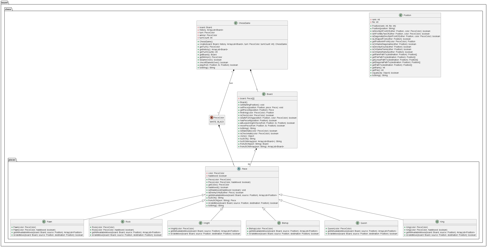

= Projet Gestion de Base de Données - Jeu d'échecs
:toc:

== Introduction

Ce projet vise à développer un jeu d'échecs en ligne innovant, intégrant une gestion de base de données robuste et une interface utilisateur réactive.

Le cœur du jeu est construit en Java, un langage de programmation polyvalent et performant, qui assure la liaison avec la base de données, la validation des mouvements des pièces d'échecs, ainsi que la mise en place d'une API HTTP REST. Cette API joue un rôle crucial dans la communication entre le backend et le frontend, garantissant une expérience utilisateur fluide et sécurisée. Ce choix a été specialement fait pour nous permettres aussi de mettre en application les notions vues en cours de JAVA ce semestre. 

Le frontend du jeu est développé en React, un framework JavaScript moderne, reconnu pour sa capacité à créer des interfaces utilisateur interactives et dynamiques. L'utilisation de React permet non seulement une expérience de jeu agréable et intuitive, mais favorise également une maintenance et une évolutivité aisées du projet.

La persistance des données est assurée par MariaDB, une base de données relationnelle open-source. MariaDB a été choisie pour sa performance, sa sécurité et sa compatibilité avec de grandes quantités de données, ce qui est essentiel pour gérer les informations des utilisateurs, les parties en cours, les historiques de jeu, et autres données critiques.

Le projet est contenu dans le dépôt Git suivant : https://github.com/faddoulelias/Chess

== La base de données

=== Modèle Conceptuel de Données

Ce modele conceptuel de données est une première vision de la forme des données. Il servira de base pour la création du modèle relationnel de données. Ainsi que pour le diagramme de classes.

Il defini les entités suivantes :
- player : un joueur
- game : une partie
- credentials : les identifiants d'un joueur
- friend_requests : une demande d'ami

Un joueur peut avoir plusieurs parties, plusieurs identifiants et plusieurs demandes d'amis.
Une partie peut avoir deux joueurs, un joueur peut avoir plusieurs parties.
Un joueur peut avoir plusieurs identifiants, un identifiant est lié à un seul joueur.
Un joueur peut envoyer plusieurs demandes d'amis, une demande d'ami est envoyée par un seul joueur.
Un joueur peut avoir plusieurs amis, un joueur peut être ami avec plusieurs joueurs (mais pas lui même).

Avec ces informations, nous pouvons créer le modèle relationnel de données si-dessous.

.Modèle Conceptuel de Données

=== Modèle Relationnel de Données

A partir du modèle conceptuel de données, nous pouvons créer le modèle relationnel de données. Pour cela, nous allons créer une table pour chaque entité, et une table pour chaque relation entre les entités. Pour les relations n-n, nous allons créer une table intermédiaire (table de jointure). 

A l'aide du logiciel MySQL Workbench, nous pouvons créer le modèle relationnel de données. Ce logiciel permet de créer un modèle relationnel de données et de générer le script SQL pour créer la base de données.

.Diagramme de la base de données

=== Script SQL

A partir du modèle relationnel de données, nous pouvons générer le script SQL pour créer la base de données. Le script SQL est disponible dans le dossier `database` du projet.

[source,sql]
----
include::../database/init.sql[]
----

Voici quelques captures d'écran des tables de la base de données (et de leurs données) :

.Capture d'écran de la table `player`

.Capture d'écran de la table `game`

.Capture d'écran de la table `credentials`

=== La table Player

.La table `player` contient les informations des joueurs. Elle contient les colonnes suivantes :
* `id` : l'identifiant du joueur (clé primaire)
* `username` : le nom d'utilisateur du joueur

Cette table, bien que simple, est très importante. Elle est directement liée à toutes les autres tables de la base de données. Elle permet de retrouver les informations d'un joueur, et de retrouver les informations liées à un joueur.

=== La table Credentials

.La table `credentials` contient les identifiants des joueurs. Elle contient les colonnes suivantes :
* `player_id` : l'identifiant du joueur
* `email` : l'adresse email du joueur
* `salt` : le sel utilisé pour hasher le mot de passe du joueur
* `sha256` : le mot de passe hashé du joueur

Cette table permet de retrouver les identifiants d'un joueur, et de vérifier son mot de passe.

==== Sécurité (hashage des mots de passe)

Lorsqu'un utilisateur s'inscrit sur le site, il doit choisir un mot de passe. Ce mot de passe est stocké dans la base de données. Mais il est important de ne pas stocker le mot de passe en clair, car si la base de données est compromise, les mots de passe des utilisateurs seront compromis. Il est donc important de stocker les mots de passe de manière sécurisée.

Cependant, une simple fonction d'encryption n'est pas suffisante. En effet, si un attaquant a accès à la base de données et a la clé d'encryption, il peut décrypter tous les mots de passe. Les mots de passe - souvant les mêmes chaque utilisateurs sur plusieurs sites - sont donc compromis.

Une fonction de hashage peut donc etre utilisée. Cette fonction prend en entrée une chaine de caractères, et retourne une chaine de caractères. Cette fonction est déterministe, c'est à dire que si on lui donne la même entrée, elle retournera toujours la même sortie. Cependant, il est impossible de retrouver l'entrée à partir de la sortie. Cette fonction est donc parfaite pour stocker des mots de passe. Mais il y a encore un problème : si un attaquant a accès à la base de données, il peut facilement reconnaitre certains mots de passe identiques chez plusieurs utilisateurs. Il peut donc utiliser une table de correspondance pour retrouver les mots de passe. On ajoute donc au début du mot de passe une chaîne de caractères aléatoire (de longueur fixe et 
suffisamment longue pour éviter les collisions). Cette chaîne de caractères est appelée "sel" (ou "salt" en anglais). Le mot de passe est donc hashé avec le sel, et le sel est stocké dans la base de données. Lorsque l'utilisateur se connecte, le sel est récupéré dans la base de données, et le mot de passe entré par l'utilisateur est hashé avec le sel. Si le résultat est identique au mot de passe hashé stocké dans la base de données, alors le mot de passe est correct.

La fonction de hashage utilisée est SHA-256. Elle retourne une chaine de caractères 32 octets. Dans la base de données, et pour des raisons de lisibilités pendant les tests, la sortie de la fonction de hashage est convertie hexadécimal. La sortie de la fonction de hashage est donc une chaine de caractères de 64 caractères hexadécimaux (32 octets = 64 caractères hexadécimaux).

Le sel est généré aléatoirement. Comme expliqué précédemment, le sel est une chaine de caractères de longueur fixe et suffisamment longue pour éviter les collisions. Nous avons choisi une longueur de 16 octets (128 bits). La longueur du sel est donc de 16 octets. Dans la base de données, le sel stocké dans un CHAR(16).

=== La table Game

.La table `game` contient les informations des parties. Elle contient les colonnes suivantes :

* `id` : l'identifiant de la partie (clé primaire)
* `playerWhite` : l'identifiant du joueur blanc
* `playerBlack` : l'identifiant du joueur noir
* `board` : la déscription du plateau de jeu (sous format JSON)
* `history` : l'historique des plateaux de jeu (sous format JSON)
* `isWhiteTurn` : un booléen indiquant si c'est au tour du joueur blanc de jouer (si `isWhiteTurn` est à 1, c'est au tour du joueur blanc de jouer, sinon c'est au tour du joueur noir de jouer)
* `turnCount` : le nombre de tours joués
* `createdAt` : la date de création de la partie
* `updatedAt` : la date de dernière mise à jour de la partie (date de la dernière action)

Cette table est la plus importante de la base de données. Elle contient toutes les informations des parties. Elle permet de retrouver les informations d'une partie, et de retrouver les parties d'un joueur. 

==== Le format JSON
Le format JSON est utilisé pour stocker les informations du plateau de jeu et l'historique des plateaux de jeu. Le format JSON est un format de données textuelles, qui est facilement lisible par les humains. Il est également facilement lisible par les machines, et est facilement parsable. Il est donc parfait pour stocker des données structurées.

Le format JSON est composé de deux types de structures : les objets et les tableaux. Un objet est une collection de paires clé-valeur. Un tableau est une collection de valeurs. Les objets et les tableaux peuvent être imbriqués. Les valeurs peuvent être des chaînes de caractères, des nombres, des booléens, des objets ou des tableaux. 

Par exemple, dans notre cas d'utilisations, le plateau de jeu est un composé d'un tableau de 8 tableaux de 8 objets. 

[source,typescript]
----
type History = Array<Board>;

type Board = Array<Array<Piece | null>>;

type Piece = {
  type: PieceType;
  color: PieceColor;
  hasMoved: boolean;
};

type PieceType =
  | "pawn"
  | "rook"
  | "knight"
  | "bishop"
  | "queen"
  | "king";

type PieceColor = "white" | "black";
----

Dans la déscription des types ci-dessus, `Piece` est un objet, `Board` est un tableau, et `History` est un tableau de `Board`.
Dans la base de données, le plateau de jeu est stocké en JSON (suivant le format Board), et l'historique des plateaux de jeu est stocké en JSON (suivant le format History).

=== La table friend_requests

.La table `friend_requests` contient les demandes d'amis. Elle contient les colonnes suivantes :
* `id` : l'identifiant de la demande d'ami (clé primaire)
* `sender` : l'identifiant du joueur qui a envoyé la demande d'ami
* `recipient` : l'identifiant du joueur qui a reçu la demande d'ami
* `status` : le statut de la demande d'ami (0 = en attente, 1 = acceptée, 2 = refusée)
* `sentAt` : la date d'envoi de la demande d'ami

Cette table permet de retrouver les demandes d'amis d'un joueur, et de retrouver les demandes d'amis envoyées par un joueur.

=== La table friends

.La table `friends` contient les amis des joueurs. (Elle joue le rôle de table de jointure entre les joueurs). Elle contient les colonnes suivantes :
* `player1_id` : l'identifiant du joueur 1 (clé primaire)
* `player2_id` : l'identifiant du joueur 2 (clé primaire)

== Le backend (Java)

.Le backend est développé en Java. Il est composé de plusieurs packages (dossiers) :
* `chess` : contient les classes du jeu d'échecs
* `database` : contient les classes de la base de données
* `server` : contient les classes du serveur

=== Le package `chess`

Le package `chess` contient les classes du jeu d'échecs. 
Ci-dessous, un diagramme de classes du package `chess` :

.Le package `chess`

==== La classe `ChessGame`

La classe `ChessGame` est la classe principale du package `chess`. Elle contient les informations d'une partie d'échecs. 
Cette classe nous permet de manipuler une partie d'échecs. Elle permet de créer une partie, gérer les mouvements des pièces, et de récupérer les informations de la partie.

==== La classe `Board`

La classe `Board` représente le plateau de jeu. Elle contient les informations du plateau de jeu, et permet de manipuler le plateau de jeu. De plus, elle permet d'effectuer les differents types de validation des mouvements des pièces. Et de s'autovérifier pour savoir si le plateau de jeu est en état d'échec ou d'échec et mat (ou d'égualité).

==== La classe `Piece` et ses classes filles

Comme son nom l'indique, la classe `Piece` représente une pièce. Elle contient les informations communes à toutes les pièces (type et couleur), et permet de manipuler une pièce. Cette classe est abstraite, et est étendue par les classes `Pawn`, `Rook`, `Knight`, `Bishop`, `Queen` et `King`. Elle contraint les classes filles à implémenter la méthode `isValidMove`, chaque pièce ayant des règles de déplacement différentes.

Les classes `Pawn`, `Rook`, `Knight`, `Bishop`, `Queen` et `King` sont des classes concrètes. Elles représentent les pièces du jeu d'échecs. Elles contiennent les informations spécifiques à chaque pièce, et implémentent la méthode `isValidMove` de la classe `Piece`.

==== L'énumération `PieceColor`

L'énumération `PieceColor` représente la couleur d'une pièce. Elle contient les valeurs `WHITE` et `BLACK`.

==== La classe `Position`

La classe `Position` représente une position sur le plateau de jeu. Elle contient les informations d'une position (colonne et ligne), et permet de manipuler une position. Elle permet également de vérifier si une position est valide. Et effectue la conversion entre une position conventionnelle en échecs (colonne de a à h, ligne de 1 à 8) et une position en notation algébrique facile à manipuler (colonne de 0 à 7, ligne de 0 à 7). 

Elle définit également des méthodes statiques pour effectuer l'arithmétique sur les positions. Par exemple, diagonale, ligne, colonne, L (pour le cavalier), etc.

=== Le package `database`

Le package `database` contient les classes de la base de données.
Ci-dessous, un diagramme de classes du package `database` :

.Le package `database`

==== La classe `Database`

La classe `Database` est la classe principale du package `database`. Elle contient les informations de la base de données. Elle permet de se connecter à la base de données, et d'effectuer des requêtes SQL.

==== La classe `GameData`

La classe `GameData` permet de représenter les données d'une partie, comme elles sont stockées dans la base de données. Elle contient les informations d'une partie, et permet de manipuler une partie. Lorseque une partie est désérialisée depuis la base de données, elle est stockée dans un objet de type `GameData`. Lorsque une partie est modifiée, elle est stockée dans un objet de type `GameData`. Lorsque une partie est sérialisée dans la base de données, elle est sérialisée depuis un objet de type `GameData`.

==== La classe `Game`

Cette classe joue le rôle de DAO (Data Access Object). Elle permet de manipuler les parties dans la base de données. Elle permet de créer une partie, de récupérer une partie, de mettre à jour une partie, et de supprimer une partie.

==== La classe `Authentication`

Cette classe joue le rôle de DAO (Data Access Object). Elle permet de manipuler les identifiants des joueurs dans la base de données. Elle permet d'ajouter un utilisateur, et de vérifier les identifiants d'un utilisateur. (`register` et `login`).

=== Le package `server`

Le package `server` contient les classes du serveur.
Ci-dessous, un diagramme de classes du package `server` :

.Le package `server`

==== La classe `App`

La classe `App` est la classe principale du backend. Elle permet de démarrer le serveur REST.

==== Serveur HTTP REST

Un serveur HTTP REST est un serveur qui adhère aux principes de **REpresentational State Transfer (REST)**¹. Voici quelques points clés à ce sujet :

1. **Interface uniforme** : REST définit une interface cohérente et uniforme pour les interactions entre les clients et les serveurs. Par exemple, les API REST basées sur HTTP utilisent les méthodes HTTP standard (GET, POST, PUT, DELETE, etc.) et les URI (Uniform Resource Identifiers) pour identifier les ressources.

2. **Architecture client-serveur** : Le modèle de conception client-serveur impose la séparation des préoccupations, ce qui permet aux composants client et serveur d'évoluer indépendamment.

3. **Sans état** : La communication ne doit avoir aucun contexte client stocké sur le serveur. Cela signifie que chaque requête au serveur doit être faite avec toutes les données requises et aucune hypothèse ne doit être faite si le serveur a des données des requêtes précédentes.

4. **Système en couches** : Le client ne doit pas être en mesure de dire s'il communique directement avec le serveur ou avec un intermédiaire. Ces serveurs intermédiaires (qu'il s'agisse de proxy ou d'équilibreurs de charge) permettent la mise à l'échelle et la sécurité du serveur sous-jacent.

En termes plus simples, lorsqu'une API REST est appelée, le serveur transfère au client une représentation de l'état de la ressource demandée. Les API REST communiquent via des requêtes HTTP pour effectuer des fonctions de base de données standard telles que la création, la lecture, la mise à jour et la suppression d'enregistrements (également appelées CRUD) au sein d'une ressource. Par exemple, une API REST utiliserait une requête GET pour récupérer un enregistrement, une requête POST pour en créer un, une requête PUT pour mettre à jour un enregistrement et une requête DELETE pour en supprimer un.

Dans notre cas, nous avons utilisé une API REST pour notre application web. Notre API REST définit les routes (endpoints) qui permettent de créer une partie, de récupérer une partie, de mettre à jour une partie, et de supprimer une partie. Elle permettra également de s'authentifier (login et register).

== Le frontend 

=== TypeScript

TypeScript est un langage de programmation libre et open source développé par Microsoft qui a pour but d'améliorer et de sécuriser la production de code JavaScript. C'est un sur-ensemble de JavaScript (c'est-à-dire que tout code JavaScript est un code TypeScript valide) mais qui ajoute des fonctionnalités supplémentaires à la manière d'un langage orienté objet. Il permet notamment de définir des types de variables et de paramètres, de définir des classes et des interfaces, et d'utiliser des modules.
Il est donc parfait pour développer une application web moderne, et permet de développer une application web robuste et sécurisée.

=== React

React est une bibliothèque JavaScript libre développée par Facebook depuis 2013. Le but principal de cette bibliothèque est de faciliter la création d'application web monopage, via la création de composants dépendant d'un état et générant une page (ou portion) HTML à chaque changement d'état. React permet de créer des interfaces utilisateur interactives et dynamiques. Il est donc parfait pour développer une application web moderne, et permet de développer une application web agréable et intuitive.

React est basé sur le concept de composants. Un composant est une partie de l'interface utilisateur. Un composant peut être une simple balise HTML, ou un composant complexe composé de plusieurs composants. Un composant peut avoir un état, et peut être mis à jour. Lorsqu'un composant est mis à jour, il est re-rendu. React permet de créer des composants réutilisables, ce qui permet de créer une application web modulaire et facilement maintenable.

=== Les composants React de notre application web

Les composant React de notre application web peuvent être divisés en deux catégories : les composants pages et les composants fonctionnels.

==== Les composants pages

Les composants pages sont les composants qui représentent les pages de notre application web. Ils sont composés de plusieurs composants fonctionnels.

Parmis les composants pages, nous avons :
* `GamePage` : la page de jeu
* `LoginPage` : la page de connexion
* `SignupPage` : la page d'inscription

D'autres composants pages sont prévus, comme la page d'accueil, la page de profil, et la page de recherche d'amis (pour ajouter des amis).

==== Les composants fonctionnels

Les composants fonctionnels sont les composants qui représentent les éléments de notre application web. Ils peuvent aussi être composés de plusieurs composants fonctionnels, et/ou de composants natifs (div, h1, span, etc...).

Parmis les composants fonctionnels, nous avons :
* `ChessBoard` : le plateau de jeu
* `ChessBoardSquare` : une case du plateau de jeu

D'autres composants fonctionnels sont prévus, pour peupler les futures pages de notre application web.

=== Visualisation des composants React

==== La page de connexion

La page de connexion contient un formulaire de connexion. Ce formulaire est composé de deux champs : un champ pour l'idientifiant (email) et un champ pour le mot de passe. Lorsque l'utilisateur clique sur le bouton "Se connecter", une requête HTTP POST est envoyée au serveur. Si les identifiants sont corrects, l'utilisateur est redirigé vers la page de jeu. Sinon, un message d'erreur est affiché.

.Capture d'écran de la page de connexion
image::./images/login-page.png[Capture d'écran de la page de connexion]

==== La page d'inscription

La page d'inscription contient un formulaire d'inscription. Ce formulaire est composé de trois champs : un champ pour le nom d'utilisateur, un champ pour l'idientifiant (email) et un champ pour le mot de passe. Lorsque l'utilisateur clique sur le bouton "S'inscrire", une requête HTTP POST est envoyée au serveur. Si les identifiants sont corrects, l'utilisateur est redirigé vers la page de jeu. Sinon, un message d'erreur est affiché.

Dans le futur, cette page contiendra également un champ pour vérifier le mot de passe (pour éviter les erreurs de frappe) et éventuellement un champ pour le nom et le prénom et d'autres informations.

.Capture d'écran de la page d'inscription
image::./images/signup-page.png[Capture d'écran de la page d'inscription]

==== La page de jeu

La page de jeu contient le plateau de jeu, ainsi que les informations de la partie (Si c'est le tour du joueur ou non, ci le joueur est en échec ou non, etc...). Dans des versions futures, cette page pourra également contenir un chat pour discuter avec l'adversaire, et un bouton pour abandonner la partie, et d'autres informations.

.Capture d'écran de la page de jeu sur 2 fenêtres

En cliquant sur une case du plateau de jeu, le joueur peut sélectionner une pièce. Les cases où la pièce peut se déplacer sont alors mises en évidence. En cliquant sur une case où la pièce peut se déplacer, le joueur effectue le mouvement. Si le mouvement est valide, la pièce est déplacée, et c'est au tour de l'autre joueur de jouer.

.Capture d'écran du plateau de jeu (Le joueur noir visualise les mouvements possibles de son roi)

